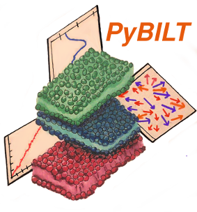

## *Py*thon based lipid *BIL*ayer molecular simulation analysis *T*oolkit

------


[](https://github.com/blakeaw/PyBILT/blob/master/LICENSE)
[](https://landscape.io/github/blakeaw/PyBILT/master)
[](https://github.com/blakeaw/PyBILT/blob/master/.docstring-coverage_report.txt)

------

PyBILT is a Python toolkit developed to analyze molecular simulation trajectories of lipid bilayers systems. The toolkit includes a variety of analyses from various lipid bilayer molecular simulation publications.

The analyses include:
   * Mean Squared Displacement (MSD)
   * Diffusion coefficent estimators (from MSD curves) - includes Einstein relation, linear fit, and anomalous diffusion fit.
   * Area per lipid estimators
   * Bilayer thickness
   * Displacement Vector (flow) maps and correlations
   * Deuterium order parameter
   * Orientation parameters
   * Mass and Electron Density Estimators
   * and more!

------


------

## Install

**Warning:** PyBILT is still under heavy development and may rapidly change.

#### PyBILT run dependencies
PyBILT has the following major dependencies that need to be installed before it
can be run:
   * MDAnalysis 0.16.2
   * NumPy 1.11.3
   * SciPy 0.18.1
   * Matplotlib 2.0.0
   * Seaborn 0.7.1

The versions of the above packages are the latest that the pybilt package has
been tested with under Anaconda 4.3.1 Python 2.7; these are the package
versions included in the conda environment.yml file.  Therefore, to reproduce
the environment that PyBILT has been tested under it is recommended that you
install [Anaconda Python](https://www.anaconda.com/) version 4.3.1 Python 2.7
before installing PyBILT. PyBILT has yet to be tested outside of an Anaconda
environment.

The following section describes the process for setting up the dependencies and
installing the 'pybilt' package using a conda environment and the setup.py
script.

#### Setup and install using Anaconda's conda tool
First, clone or download the GitHub repo
```
git clone https://github.com/blakeaw/PyBILT.git
```
The file environment.yml has been provided to allow for easy setup of a new
environment with all the appropriate dependencies using the conda tool. From the PyBILT root run
```
conda env create -f environment.yml
```
which will create a new conda environment named *pybilt* with the appropriate
dependencies. Then activate the environment
```
source activate pybilt
```
Next, run the setup.py script with install,
```
python setup.py install
```
to install the 'pybilt' package into the *pybilt* environment.    

------

## Quick overview of PyBILT
**PyBILT** is composed of 2 primary analysis packages:
  * bilayer_analyzer -- The [bilayer_analyzer](http://pybilt.readthedocs.io/en/latest/pybilt.bilayer_analyzer.html#module-pybilt.bilayer_analyzer.bilayer_analyzer) is an analysis package that
                        is designed to analyze (quasi) planar lipid bilayer
                        systems. It is accessed through the BilayerAnalyzer
                        object, which can be imported via: ```from
                        pybilt.bilayer_analyzer import BilayerAnalyzer```. The
                        BilayerAnalyzer features automatic dynamic unwrapping of
                        coordinates and leaflet detection. The bilayer_analyzer
                        works on a multiple-representation model, whereby the
                        various analyses are conducted using different
                        representations of the bilayer lipids. Bilayer lipids
                        can be represented using the following four
                        representations:
    * All atom
    * Centers-of-mass -- Each lipid (or selection of atoms from each lipid) is reduced to a
center-of-mass.
    * Grid (or lipid grid) -- The lipids are mapped to two-dimensional grids (one for each leaflet) in the
style of the [GridMAT-MD method](http://www.bevanlab.biochem.vt.edu/GridMAT-MD/)
    * Vectors - Each lipid is converted to a vector representation using select reference atoms (or sets of reference atoms) that are used to compute the head and tail of the vector; e.g., a lipid tail atom to lipid head atom, or P-N vectors.

The bilayer_analyzer features various types of analyses and the use of different
representations is handled internally based the requirements and design of each
analysis type. See the [documentation](http://pybilt.readthedocs.io/en/latest/pybilt.bilayer_analyzer.html#module-pybilt.bilayer_analyzer.analysis_protocols) for more details on
individual analyses and the representations they use.   

  * [mda_tools](http://pybilt.readthedocs.io/en/latest/pybilt.mda_tools.html) -- This package includes various modules and functions for directly
                 analyzing and operating on MDAnalysis trajectories and objects.
                 e.g. functions to compute density profiles.

 Additional packages include:
   * [lipid_grid](http://pybilt.readthedocs.io/en/latest/pybilt.lipid_grid.html) -- The lipid grid module can be used construct "lipid grid" grid
                  representations of lipid bilayers, which can be used to
                  accurately estimate quantities such as area per lipid.

  * [com_trajectory](http://pybilt.readthedocs.io/en/latest/pybilt.com_trajectory.html) -- This module can be used to construct a center of mass
                      trajectory (COMTraj) out of an MDAnalysis trajectory,
                      which is useful for computing quantities like mean squared
                      displacement. The COMTraj is designed to work with bilayers.

  * [plot_generation](http://pybilt.readthedocs.io/en/latest/pybilt.plot_generation.html) -- This module has several pre-written plotting functions
                       (using matplotlib and seaborn) for some of the properties
                       that can be computed from functions in the other modules.
                       e.g. mean squared displacement and area per lipid.


## Additional Documentation/Tutorials

In addition to the documentation, there are currently a few Jupyter IPython
[notebooks](https://github.com/blakeaw/PyBILT/tree/master/jupyter_notebooks)
that provide some examples and show some basic usage. More of these are also in
the pipeline. Although they are also not fully extensive, the
[tests](https://github.com/blakeaw/PyBILT/tree/master/tests) can serve as a
useful place to examine some basic usage and functionality.

## Contact

To report problems or bugs please open a [GitHub Issue](https://github.com/blakeaw/PyBILT/issues).
Additionally, any comments, suggestions, or feature requests for PyBILT can also be submitted as a [GitHub Issue](https://github.com/blakeaw/PyBILT/issues).

For any other inquiries, including questions about PyBILT use or
implementation, you can contact Blake directly via e-mail at either
blake.a.wilson@vanderbilt.edu or blakeaw1102@gmail.com; please include "PyBILT
inquiry" in the e-mail subject line.

## Contributing

If you would like to contribute to PyBILT's development please
 1. Fork the repo (https://github.com/blakeaw/PyBILT/fork)
 2. Create a new branch for your feature (git checkout -b feature/foo_bar)
 3. Create test code for your feature and then run all the tests using py.test  
 4. Once your feature passes all the tests, commit your changes (git commit -am 'Add the foo_bar feature.')
 5. Push to the branch (git push origin feature/foo_bar)
 6. Create a new Pull Request

## License

This project is licensed under the MIT License - see the
[LICENSE](https://github.com/blakeaw/PyBILT/blob/master/LICENSE) file for
details

## Acknowledgments

* A special thanks to James Pino (https://github.com/JamesPino) for his inciteful
comments and suggestions that have helped improve the quality of this code, and
thanks to him for pointing out some very useful coding tools.   
* Thanks to my advisors, Carlos F. Lopez and Arvind Ramanathan, for catalyzing
this project and for providing me with the space and means to pursue it.  

## Built With

* [ANACONDA](https://www.continuum.io/) - ANACONDA Python distribution and CONDA package and environment manager
* [PyCharm](https://www.jetbrains.com/pycharm/) - Primary Text Editor/IDE
* [ATOM](https://atom.io/) - Secondary Text Editor
* [Sublime Text](https://www.sublimetext.com/) - Text Editor used in earlier work
* [Landscape](https://landscape.io/) - Code quality analysis and tracking
* [Git](https://git-scm.com/) - Version control
* [GitHub](https://github.com/) - Development Platform and repository storage
* [Sphinx](http://www.sphinx-doc.org/en/stable/index.html) - Python documentation generator
* [recommonmark](https://github.com/rtfd/recommonmark) - A docutils-compatibility bridge to CommonMark.
* [Read the Docs](https://readthedocs.org/) - Documentation hosting
* [docstring-coverage](https://bitbucket.org/DataGreed/docstring-coverage/wiki/Home) -  A simple audit tool for examining python source files for missing docstrings.

## Core Developers

* **Blake A Wilson** - Currently a Postdoctoral Fellow at Vanderbilt University
  * Vandy e-mail: blake.a.wilson@vanderbilt.edu
  * Gmail: blakeaw1102@gmail.com
  * [Blake's VU Website]( https://my.vanderbilt.edu/blakeaw/)
  * Also find me on [LinkedIn](https://www.linkedin.com/in/blakewilson3/) and [Research Gate](https://www.researchgate.net/profile/Blake_Wilson3)
